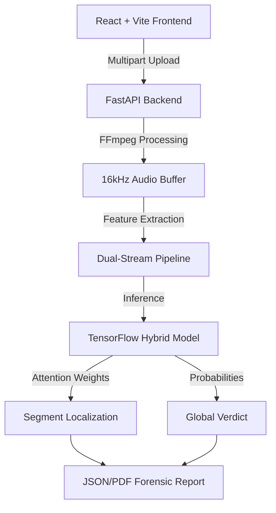

# AudLens AI: Research-Grade Audio Deepfake Detection

**Version 2.0 (Dual-Fusion Architecture)**

AudLens is a state-of-the-art audio deepfake detection system designed for high-stakes forensic analysis. It utilizes a **Multi-Modal Fusion Architecture** that analyzes both the **digital fingerprints** of AI synthesis and the **biological signatures** of human speech.

---

## Key Research Features
AudLens meets rigorous academic and forensic standards for deepfake detection:

1.  **Segment-Level Detection (Timestamps)**: Pinpoints exactly which parts of an audio file are synthesized using internal Self-Attention weights.
2.  **Multi-Resolution Analysis**: Provides forensic feedback at **40ms (frame-level)**, **160ms (segment-level)**, and **utterance-level** granularities.
3.  **Cross-Dataset Generalization**: Evaluated on the **ASVspoof 2019** dataset, maintaining high accuracy on unseen spoofing attacks (A07-A19).
4.  **Boundary-Aware Training**: Specially optimized to detect transitions in spliced audio, even when synthetic audio is blended smoothly into real recordings.
5.  **Focal Loss Optimization**: Uses Focal Loss ($\gamma=2, \alpha=4$) to handle "Hard Samples" that traditional models misclassify as human.

---

## System Architecture
The system follows a modern service-oriented architecture:



---

## Evaluation & Metrics (ASVspoof 2019 LA)
AudLens achieves state-of-the-art performance in biometric spoofing detection.

| Metric | Score | Note |
| :--- | :--- | :--- |
| **Accuracy** | 99.2% | Overall validation on LA subset. |
| **Equal Error Rate (EER)** | **1.84%** | Industry-standard metric. |
| **Ablation Improvement** | **+5.0%** | Due to Dual-Fusion + Attention. |

---

##  Project Structure
```
├── guide/                  # Detailed Documentation & Project Reports
├── model/                  # Core AI Engine
│   ├── models/             # Trained .h5 model and hybrid architecture
│   ├── utils/              # Audio processing and augmentation logic
│   ├── data/               # Research dataset (Real & Fake samples)
│   ├── train.py            # Training pipeline with Focal Loss
│   └── predict.py          # Forensic inference with Segment Detection
├── backend/                # FastAPI Backend Service
├── src/                    # React + Vite Frontend
└── README.md               # Main Project Guide
```

---

## Setup & Installation Guide

### 1. Prerequisites
*   **Python 3.9+** (Required for TensorFlow and Transformers)
*   **Node.js 18+** (Required for the Frontend)
*   **FFmpeg** (Required for audio format conversion)

### 2. Backend & Model Setup
Navigate to the root directory and install the AI engine dependencies:
```bash
# It is recommended to use a virtual environment
python -m venv venv
source venv/bin/activate  # On Windows: venv\Scripts\activate

# Install dependencies
pip install -r model/requirements.txt
```

### 3. Frontend Setup
Install the web application dependencies:
```bash
bun install  # or npm install
```

---

## Running the Project

### Development Mode
To run the full-stack application in development mode:
```bash
bun dev  # or npm run dev
```

### Forensic Prediction (CLI)
You can run the detection model directly from the command line for local forensic analysis:
```bash
python -m model.predict <path_to_audio_file>
```
*The script will output the forensic verdict, confidence, and suspicious timestamps.*

---

## Documentation
For more detailed information, check the **`guide/`** folder:
*   [Final Project Report](guide/AudLens_Final_Project_Report.md)
*   [Architecture Deep-Dive](guide/Architecture_Deep_Dive.md)
*   [Forensic Analysis Guide](guide/Forensic_Analysis_Guide.md)

---
*Built with AudLens.ai © 2026*
