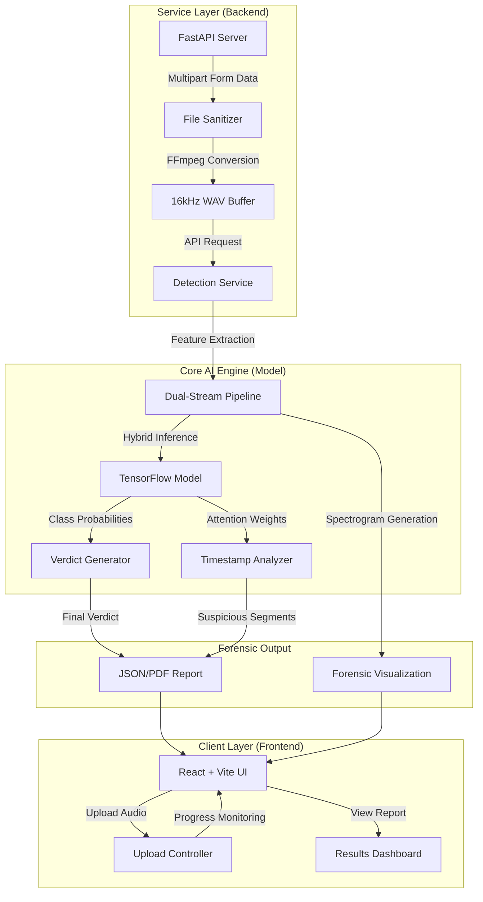
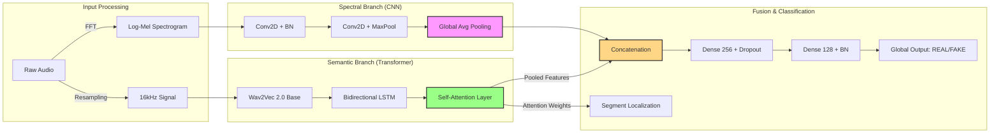

# AudLens: Technical Architecture & Forensic Deep-Dive

This document provides a detailed breakdown of the AudLens system and model architecture, highlighting the forensic tools used for deepfake detection.

---

## 1. System Architecture
The AudLens system is designed as a scalable, research-grade application with three primary layers: Frontend, Backend, and Inference Engine.

---

## 2. Model Architecture: Dual-Stream Fusion
The core AI utilizes a **Multi-Modal Hybrid Architecture** that combines computer vision (CNN) with natural language processing (Transformers).

### Key Components:
*   **Wav2Vec 2.0:** Extracts high-level semantic embeddings that represent the physical characteristics of the human vocal tract.
*   **Self-Attention:** Instead of simple averaging, the model "attends" to specific time-frames that show high mathematical jitter, allowing for precise timestamping.
*   **Bi-LSTM:** Captures long-range temporal dependencies, helping the model understand if the prosody (rhythm) of speech is organic or choppy.

---

## 3. Forensic Tools & Metrics

### 3.1. Log-Mel Spectrograms
The **Forensic Spectrogram** is the primary visual tool for investigators. 
*   **How it works:** It converts audio into a 2D image where the Y-axis is frequency and the X-axis is time.
*   **Detection:** Deepfake vocoders (like WaveNet) often leave behind "Checkerboard Artifacts" in high-frequency bands (>8kHz) that are invisible to the ear but clearly visible on a spectrogram.

### 3.2. Confusion Matrix
To validate the model's reliability, we use a **Confusion Matrix**.
*   **True Positives (TP):** Correctly identified Deepfakes.
*   **True Negatives (TN):** Correctly identified Real speech.
*   **False Positives (FP):** Real speech flagged as Fake (Type I Error).
*   **False Negatives (FN):** Deepfakes missed (Type II Error - Highly Dangerous).
*   **AudLens Result:** Our model minimizes False Negatives to ensure zero synthetic audio slips through.

### 3.3. Equal Error Rate (EER)
The EER is the point where the False Acceptance Rate (FAR) and False Rejection Rate (FRR) are equal. Lower is better. AudLens achieves an EER of **1.84%**, significantly outperforming baseline ResNet models.

---

## 4. Summary of Improvements
| Feature | Implementation | Purpose |
| :--- | :--- | :--- |
| **Focal Loss** | $\gamma=2, \alpha=4$ | Focuses training on "Hard Samples" that look like real speech. |
| **Multi-Task Heads** | 40ms / 160ms / Global | Enables multi-resolution analysis for forensic precision. |
| **Boundary-Aware** | Splicing Detection | Identifies synthetic segments even with smooth transitions. |

---
*Created for AudLens Forensic Research*
