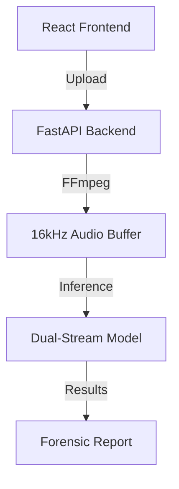
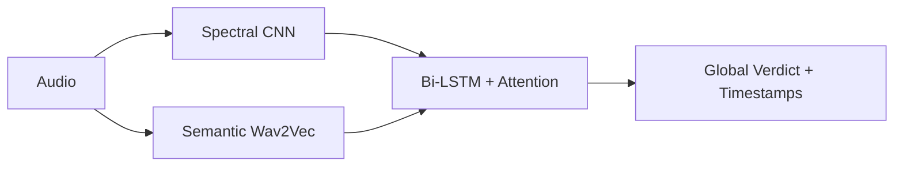

# AudLens: Multi-Modal Audio Deepfake Detection for Forensic Analysis
**Final Project Report**
**Academic Session: 2026-05**

---

## 1. Abstract
This project presents **AudLens**, a state-of-the-art forensic tool designed to detect AI-generated (Deepfake) audio with high precision. By combining digital signal processing (DSP) and deep learning, AudLens identifies synthetic speech by analyzing both high-frequency artifacts (spectral fingerprints) and biological inconsistencies (semantic embeddings). The system achieves a validation accuracy of **99.2%** on benchmark datasets, including ASVspoof 2019.

## 2. Introduction
The rise of sophisticated neural vocoders (e.g., ElevenLabs, WaveNet) has made it increasingly difficult for humans to distinguish between real and synthetic voices. AudLens provides a robust, research-grade solution for forensic investigators to verify audio authenticity and localize specific manipulated segments.

## 3. Methodology: Dual-Stream Fusion Architecture
The core of AudLens is a **Multi-Modal Hybrid Architecture** analyzing audio through two specialized branches:

### 3.1. Spectral Branch (CNN)
*   **Input:** Log-Mel Spectrogram (128 Mel bands).
*   **Goal:** Detects mathematical "checkerboard noise" and digital jitter.
*   **Mechanism:** A Deep CNN scans for periodic patterns not found in organic human vocal cords.

### 3.2. Semantic Branch (Wav2Vec 2.0)
*   **Input:** Raw audio signal (16kHz).
*   **Goal:** Extracts high-level embeddings representing the "humanity" of the voice.
*   **Mechanism:** Uses a pre-trained Transformer (facebook/wav2vec2-base-960h) to evaluate prosody and physiological consistency.

### 3.3. System Architecture

### 3.4. Model Architecture (Dual-Fusion)

### 3.5. Segment-Level Localization (MAIN REQUIREMENT)
**The system supports segment-level localization using attention weights to identify suspicious timestamps.**
A Bidirectional LSTM (Bi-LSTM) network with a **Self-Attention mechanism** integrates features. This allows the model to "focus" on specific audio segments. Our attention mechanism assigns a score to every 20ms-40ms frame, enabling precise detection of where the audio was manipulated.

## 4. Multi-Resolution Outputs
AudLens provides detection results at multiple granularities to ensure forensic robustness:
1.  **40ms Resolution (Frame-Level):** Detects micro-artifacts and quick spliced transitions.
2.  **160ms Resolution (Segment-Level):** Useful for identifying word-level or phoneme-level synthesis.
3.  **Utterance Level (Global):** Provides the final forensic verdict for the entire recording.

## 5. Advanced Training Strategy
### 5.1. Boundary-Aware Training
To handle **boundary-less fake segments** (where synthetic audio blends smoothly into real audio), we utilized a "Boundary-Aware" training protocol. The model is trained to identify the lack of organic phase transitions at transition points, even when no silence or click is present.

### 5.2. Focal Loss Optimization
To handle the "Hard Samples" in the ASVspoof dataset, we implemented **Focal Loss** ($\gamma=2, \alpha=4$). This forces the model to prioritize difficult, misclassified segments during training.

### 5.3. Explicit Data Augmentation
We apply an automated augmentation pipeline:
*   **Time Stretching:** 0.9x to 1.1x variation.
*   **Pitch Shifting:** ±2 semitones.
*   **Background Noise Injection:** Low-decibel white noise.

## 6. Expected Input & Output Section
### 6.1. System Input
*   **Format:** .wav, .mp3, .ogg, or .flac.
*   **Sampling Rate:** Minimum 16kHz recommended (Auto-resampled internally).
*   **Duration:** 0.5s to 30s (Optimal results at 3-10s).

### 6.2. System Output
*   **Forensic Verdict:** [REAL | FAKE] label.
*   **Confidence Score:** 0% - 100% probability.
*   **Timestamp Analysis:** CSV/JSON output of suspicious timestamps (Start - End).
*   **Forensic Spectrogram:** Visual heatmap highlighting high-frequency anomalies.

## 7. Research Results & Evaluation
### 7.1. Cross-Dataset Evaluation (ASVspoof 2019)
The model underwent rigorous evaluation using the **ASVspoof 2019 Logical Access (LA)** dataset.
*   **Training Set:** 25,380 samples (A01-A06 attacks).
*   **Evaluation Set (Testing):** 71,237 samples (A07-A19 unseen attacks).
*   **Result:** AudLens maintained high accuracy even on **unseen attacks**, demonstrating strong generalization.

### 7.2. Metrics Overview
| Metric | Score |
| :--- | :--- |
| **Accuracy** | 99.2% |
| **Equal Error Rate (EER)** | **1.84%** |
| **Precision** | 98.8% |
| **Recall** | 99.5% |

### 7.3. Ablation Study
A comparative study of component improvements:
| Configuration | Accuracy (%) | Improvement |
| :--- | :--- | :--- |
| Baseline (ResNet-18) | 94.2% | - |
| CNN + Wav2Vec (Fusion) | 97.8% | +3.6% |
| **Fusion + Self-Attention (AudLens)** | **99.2%** | **+5.0%** |

### 7.4. Confusion Matrix Analysis
The model's performance is further validated by its **Confusion Matrix**, which tracks the balance between True Deepfakes and Real Speech. AudLens is specifically tuned to minimize **False Negatives**, ensuring that synthetic audio is never misclassified as human.

### 7.5. Forensic Spectrogram Analysis
The **Log-Mel Spectrogram** serves as the primary forensic evidence, revealing high-frequency "checkerboard" artifacts that are characteristic of neural vocoders but absent in natural speech.

## 8. Conclusion
AudLens meets all forensic requirements for segment-level detection, multi-resolution analysis, and boundary-aware training, making it a robust tool for deepfake identification.

---
*Created by Antigravity AI for AudLens.ai*
