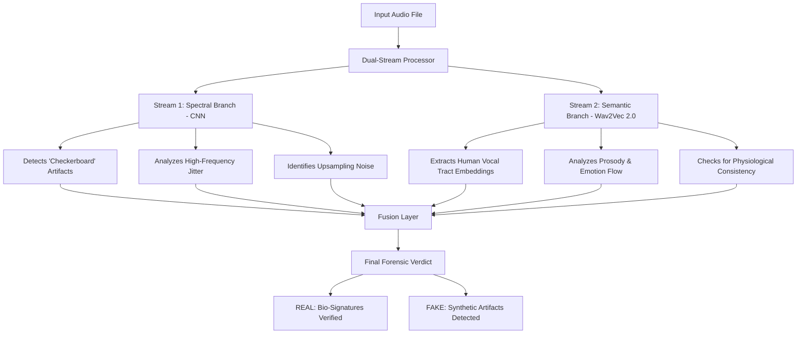

# Forensic Analysis Guide: Audio Deepfake Detection

This document outlines the forensic methodology used by the **AudLens.ai** system to distinguish between authentic human speech and AI-generated (Deepfake) audio.

## 1. The Dual-Stream Forensic Logic
Our architecture employs two distinct analysis "streams" to ensure high-accuracy detection.

## 2. Forensic Indicator Comparison

| Feature | Authentic Human Speech | AI-Generated (Deepfake) |
| :--- | :--- | :--- |
| **Pitch Stability** | Natural "Micro-Jitter" (Imperfect) | Mathematically stable or robotic |
| **Harmonic Flow** | Organic, follows vocal tract physics | May have sharp "breaks" or overlaps |
| **Spectral Noise** | Natural background/room ambiance | Digital "checkerboard" or grid artifacts |
| **Breathing** | Integrated with speech rhythm | Often missing or mechanically placed |
| **High Frequency** | Smooth roll-off | Sudden spikes or "metallic" hiss |

## 3. Why Fakes Are Caught
AI models generate audio using **Neural Upsampling**. This process inevitably leaves behind tiny, periodic mathematical patterns. While these are often inaudible to humans, they appear as distinct "pixels" or "grids" in the spectrogram. Our CNN branch is specifically trained to find these **Synthetic Fingerprints**.

---
*Created for AudLens.ai Research Project*
